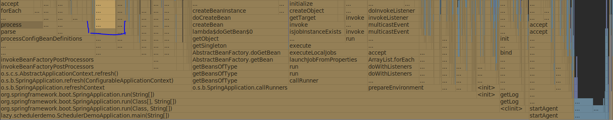

# Spring Boot Demo

This project is a small demo project that

- executes a toy batch with Spring Batch
- has lazy initialization enabled by default

When profiled, the method
```
org.springframework.boot.autoconfigure.task.ScheduledBeanLazyInitializationExcludeFilter.isExcluded(String, BeanDefinition, Class)
```
takes up a surprisingly large amount of room in the flame graph:



It's more than 3% of the overall run-time, which isn't much in the big scheme of things.
But it's nevertheless unnecessary as the application has not opted in to scheduling with `@EnableScheduling`.

The filter can be disabled by excluding the `TaskSchedulingAutoConfiguration`.
